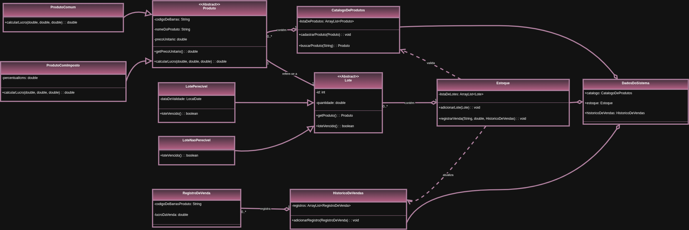

# 📦 Stokos: Sistema de Gestão de Estoque

Stokos é um sistema desktop para gerenciamento de estoque, desenvolvido em **Java** com **Swing** para a interface gráfica. O projeto foi construído como parte da disciplina de Programação Orientada a Objetos (MC322), com forte enfoque na aplicação de conceitos fundamentais de POO.

O sistema permite que pequenas empresas gerenciem seu catálogo de produtos, controlem a entrada e saída de lotes (perecíveis e não perecíveis), registrem vendas, gerem relatórios e respondam a alertas em tempo real. Todos os dados são persistidos em um arquivo local, garantindo que as informações não sejam perdidas ao fechar a aplicação.

---

## 📑 Sumário

- [🎥 Vídeo de Demonstração](#-vídeo-de-demonstração)
- [✨ Principais Funcionalidades](#-principais-funcionalidades)
- [🏗️ Arquitetura e Conceitos de POO Aplicados](#-arquitetura-e-conceitos-de-poo-aplicados)
- [🚀 Como Executar o Projeto](#-como-executar-o-projeto)
- [🧪 Como Executar os Testes](#-como-executar-os-testes)
- [👥 Autores](#-autores)

---

## 🎥 Vídeo de Demonstração

Uma demonstração em vídeo do sistema em funcionamento está disponível no link abaixo:

- [https://youtu.be/EQ_4Zayl6uA](#) <!-- Substitua pelo link real -->

---

## ✨ Principais Funcionalidades

O sistema oferece um conjunto completo de ferramentas para uma gestão de estoque eficiente:

- **🔐 Autenticação de Usuários:**  
    Sistema de login seguro que diferencia usuários por cargos (`CEO`, `ESTAGIARIO`), controlando o acesso a funcionalidades críticas como alteração de produtos e registro de descartes.

- **📚 Gerenciamento do Catálogo de Produtos:**  
    - Cadastro de novos produtos, com suporte a `ProdutoComum` e `ProdutoComImposto (ICMS)`.
    - Pesquisa de produtos por código de barras ou nome.
    - Alteração e remoção de produtos existentes (acesso restrito ao CEO).

- **📊 Gerenciamento de Estoque (Lotes):**  
    - Adição de novos lotes, com distinção polimórfica entre `LotePerecivel` (com data de validade) e `LoteNaoPerecivel`.
    - Registro de saídas por venda, com baixa de estoque automática seguindo as estratégias **FEFO** (First-Expire, First-Out) para perecíveis e **FIFO** (First-In, First-Out) para não perecíveis.
    - Registro de descarte de produtos (perda, avaria, etc.), funcionalidade restrita ao CEO.

- **🔔 Painel de Avisos e Alertas:**  
    - Dashboard que exibe alertas críticos em tempo real.
    - Notificações para lotes vencidos ou próximos do vencimento.
    - Alertas para produtos que atingiram o estoque mínimo ou estão zerados.

- **📄 Relatórios e Exportação:**  
    - Geração de relatório consolidado: quantidade disponível, quantidade vendida, lucro total estimado e quantidade descartada por produto.
    - Exportação do relatório completo para arquivo `.csv`, compatível com qualquer software de planilha.

- **💾 Persistência de Dados:**  
    O estado completo do sistema (catálogo, estoque, histórico) é salvo automaticamente em um arquivo binário (`stokos_dados.stk`) ao fechar a aplicação e carregado ao iniciar, garantindo a integridade dos dados.

---

## 🏗️ Arquitetura e Conceitos de POO Aplicados

O projeto foi cuidadosamente desenhado para ser um estudo de caso da aplicação de princípios da Programação Orientada a Objetos em uma arquitetura em camadas bem definida.

### **Arquitetura em Camadas**

- `stokos/`: Pacote raiz com a classe `Main` (ponto de entrada) e o `AppContext`.
- `stokos/gui/`: Camada de Apresentação (JFrames da interface gráfica, ex: `TelaLogin`, `TelaProdutos`).
- `stokos/model/`: Camada de Modelo (dados e regras de negócio, ex: `Produto`, `Estoque`, `Lote`).
- `stokos/service/`: Camada de Serviço (lógicas de negócio como autenticação e exportação).
- `stokos/persistence/`: Camada de Persistência (salvar/carregar dados, abstração de arquivos).
- `stokos/exception/`: Exceções customizadas do sistema.

### Diagrama de Classes (UML)
O diagrama a seguir ilustra as principais classes do sistema, seus atributos, métodos e os relacionamentos entre elas (herança, agregação e composição).



### **Pilares da POO no Projeto**

- **Abstração e Herança:**  
    Classes `Produto` e `Lote` são abstratas, definindo contratos para subclasses.
    - `ProdutoComum` e `ProdutoComImposto` herdam de `Produto`.
    - `LotePerecivel` e `LoteNaoPerecivel` herdam de `Lote`.

- **Polimorfismo:**  
    - Cálculo de lucro: `produto.calcularLucro(...)` executa a versão correta do método.
    - Controle de estoque: uso de `instanceof` para FEFO/FIFO.
    - Geração de alertas: métodos polimórficos em `Lote`.

- **Encapsulamento:**  
    Todos os atributos das classes de modelo são `private`, com acesso via getters/setters.

### **Outros Conceitos e Padrões**

- **Singleton AppContext:**  
    Garante instância única dos dados e serviços, centralizando o acesso.

- **Exceções Customizadas:**  
    - `ProdutoJaCadastradoException`
    - `ProdutoNaoCadastradoException`
    - `QuantidadeInsuficienteException`
    - `LoteNaoVazioException`

- **Enumerações:**  
    - `Cargo`: papéis de usuário (`CEO`, `ESTAGIARIO`)
    - `Grandeza`: unidades de medida (`PESO`, `UNIDADE`, `VOLUME`)

---

## 🚀 Como Executar o Projeto

### **Pré-requisitos**

- Java Development Kit (JDK) versão 11 ou superior.

### **Passos para Compilação e Execução**

1. Clone o repositório ou baixe os arquivos para uma pasta em seu computador.
2. Abra um terminal na pasta raiz do projeto (a que contém o diretório `src`).
3. Compile todo o código-fonte com o comando:

     ```bash
     javac -d bin -cp src src/stokos/*.java src/stokos/exception/*.java src/stokos/gui/*.java src/stokos/model/*.java src/stokos/persistence/*.java src/stokos/service/*.java
     ```

4. Execute a aplicação com:

     ```bash
     java -cp bin stokos.Main
     ```

### **Credenciais de Acesso**

- **Usuário CEO:** `esther` / **Senha:** `mc322`
- **Usuário Estagiário:** `athyrson` / **Senha:** `mc322`

---

## 🧪 Como Executar os Testes

O projeto inclui uma suíte de testes funcionais que verifica a lógica de negócio pelo console, de forma isolada da interface gráfica.

1. Certifique-se de que o projeto já foi compilado.
2. Execute a classe de testes:

     ```bash
     java -cp bin stokos.TesteFuncionalidades
     ```

O console exibirá o resultado de cada teste (SUCESSO ou FALHA). Os testes utilizam um arquivo de dados separado (`stokos_dados_teste.stk`) para não interferir com os dados da aplicação principal.

---

## 👥 Autores

- **Julia Cotrim Chinaglia** — RA: 166888
- **Vinicius Leandro Deloi** — RA: 251716

